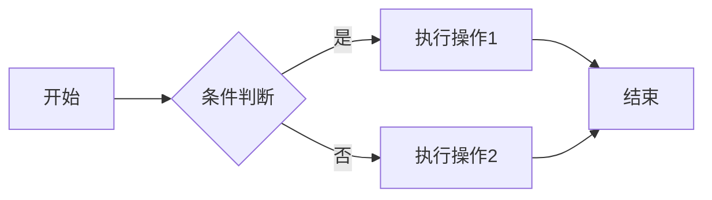
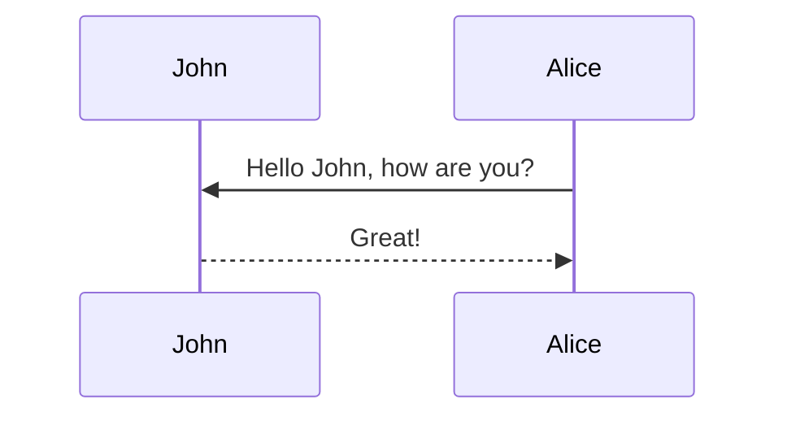
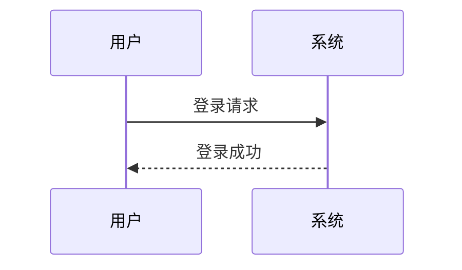
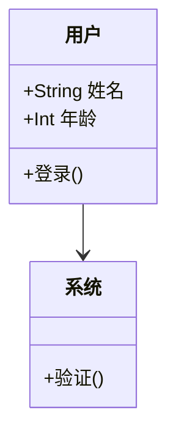
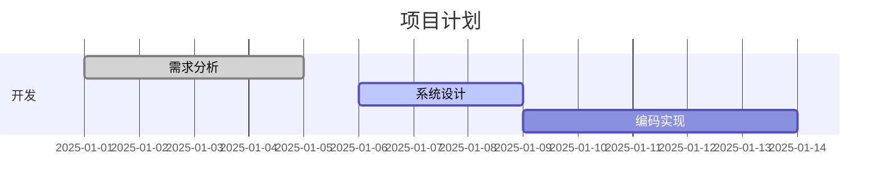
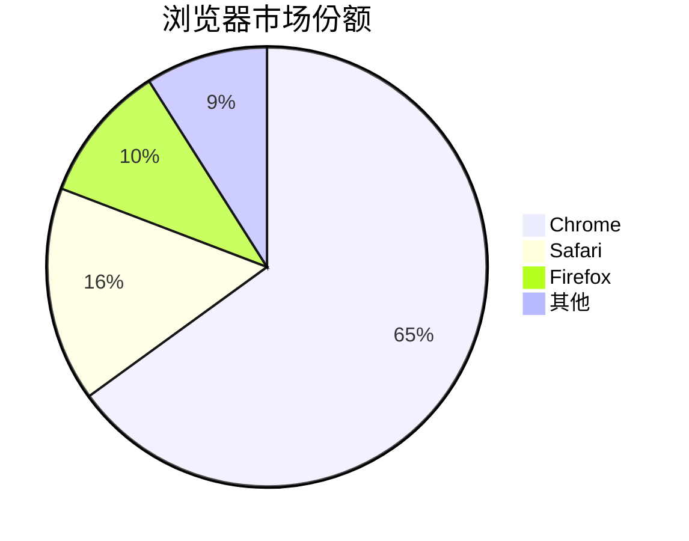

## 如何在Markdown中使用Mermaid图表

al-folio主题原生支持Mermaid图表，您只需在Markdown文件中使用代码块并指定语言为mermaid即可。

### 基本语法

````markdown
```mermaid
图表类型
    图表内容
```
````

### 流程图示例

````markdown

````


````markdown

````


### 序列图示例

````markdown

````


### 类图示例

````markdown

````


### 甘特图示例

````markdown

````


### 饼图示例

````markdown

````


## 最佳实践

1. 保持图表简洁，避免过于复杂
2. 为图表添加适当的标题说明
3. 测试图表在不同设备上的显示效果
4. 使用al-folio默认的配色方案保持风格统一

更多Mermaid语法请参考[官方文档](https://mermaid.js.org/)